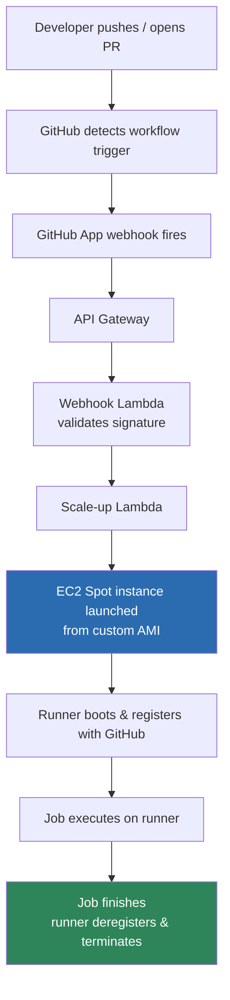

# aws-github-runners

> Terraform + Packer blueprint for self-hosted, ephemeral GitHub Actions runners on EC2 Spot with a custom AMI.

A generic, portable blueprint for self-hosted ephemeral GitHub Actions runners on AWS: EC2 Spot instances booting from a custom Packer AMI, autoscaled by the community [`github-aws-runners/terraform-aws-github-runner`](https://github.com/github-aws-runners/terraform-aws-github-runner) module.

Terraform in [`terraform/`](terraform) is driven entirely by `terraform.tfvars` (region, account ID, project name, VPC/subnets), so this applies to any repo or stack without editing source.

Scope is deliberately just the compute/pipeline layer — how jobs get a runner, not what those jobs do once they're on it. Any workflow you'd normally run can run on top of this.

---

## Why this exists

- **Cheaper than GitHub-hosted minutes** once you're running more than a trivial amount of CI, and it sidesteps GitHub's runner queue during traffic spikes.
- **Ephemeral** — each runner is launched fresh for one job, registers, runs, deregisters, and terminates. No idle fleet, no state surviving between jobs.
- **Spot** — ephemeral runners are the ideal Spot workload (short-lived, retry-safe), routinely ~70% cheaper than on-demand.
- **Custom AMI** — Docker, the runner binary, and your tools are pre-baked, so there's no install-at-boot step. How much that actually saves for your setup: [docs/01-concepts.md](docs/01-concepts.md#how-fast-is-boot-really).

## Architecture



Full breakdown of each component (webhook Lambda, scale-up Lambda, binary syncer, etc.) is in [docs/01-concepts.md](docs/01-concepts.md).

## Docs

| Doc | What's in it |
|---|---|
| [docs/01-concepts.md](docs/01-concepts.md) | Why ephemeral + Spot + custom AMI, and what each infra component does |
| [docs/02-setup-guide.md](docs/02-setup-guide.md) | Step-by-step: GitHub App → secrets → build the AMI → deploy Terraform → wire it up |
| [docs/03-org-rollout.md](docs/03-org-rollout.md) | What changes going from a personal/single-team setup to an org-wide rollout |
| [docs/04-runner-strategies.md](docs/04-runner-strategies.md) | Ephemeral vs. persistent, one fleet vs. several ("multi-cluster") — when to use which |
| [docs/05-operations.md](docs/05-operations.md) | AMI rebuild cadence, housekeeping, cost notes |

## Quick start

1. Have an AWS account with a VPC, and org/repo admin on GitHub. Full prerequisites: [docs/02-setup-guide.md](docs/02-setup-guide.md#prerequisites).
2. Follow the [setup guide](docs/02-setup-guide.md) start to finish — it's linear, six steps.
3. Only after that works: read [runner strategies](docs/04-runner-strategies.md) to decide if you need more than one fleet, and [org rollout](docs/03-org-rollout.md) if this is going beyond your own account.

## Repo layout

```
.
├── README.md                   — you are here
├── docs/
│   ├── 01-concepts.md
│   ├── 02-setup-guide.md
│   ├── 03-org-rollout.md
│   ├── 04-runner-strategies.md
│   └── 05-operations.md
├── terraform/                  — the runner fleet (github_runner module wrapper)
│   ├── versions.tf
│   ├── variables.tf
│   ├── main.tf
│   ├── outputs.tf
│   └── terraform.tfvars.example
└── scripts/
    └── download-lambda-packages.sh
```
