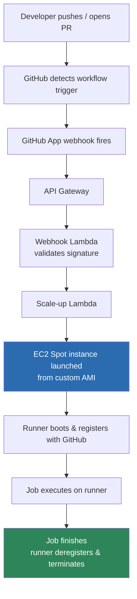

# Concepts — how this actually works

Read this before the [setup guide](02-setup-guide.md) if you want to know *why* each step exists, not just what to type. If you just want to get running, skip to the setup guide and come back here when something doesn't make sense.

## The problem with GitHub-hosted runners

GitHub-hosted runners are fine until they aren't: shared queue during traffic spikes, capped minutes/cost on private repos, and no control over what's pre-installed on the box (so every job re-installs the same tools). Self-hosting fixes all three, at the cost of owning the infrastructure.

## The three ideas that make self-hosting not a chore

**1. Ephemeral, not persistent.** A naive self-hosted runner is a long-running EC2 instance that sits idle waiting for jobs — it's an always-on attack surface (whatever it installed for job #1 is still there for job #47) and an always-on cost. An *ephemeral* runner is the opposite: launched fresh for one job, registers with GitHub, runs exactly one job, deregisters, and terminates. No state survives between jobs, and you pay only for the minutes a job actually runs.

**2. Spot, not on-demand.** Since each runner lives for the duration of one job (usually minutes), a Spot interruption just means that one job retries on a fresh instance — there's no long-lived process to lose. This is the ideal Spot workload: short-lived, stateless, retry-safe. It's routinely ~70% cheaper than on-demand.

**3. Custom AMI, not stock + bootstrap script.** A stock Ubuntu AMI needs Docker, the runner binary, and your build tools installed at boot via a `user_data` script. The upstream module's own docs are blunt about the cost of skipping this: downloading the runner binary alone, without a prebuilt AMI or the binary-syncer S3 cache, "can occasionally take more than 10 minutes." Baking everything into an AMI ahead of time with Packer (see [setup guide, step 3](02-setup-guide.md#step-3--build-the-custom-ami)) removes that install-at-boot step entirely, and every runner starts from an identical, known-good environment. See [How fast is boot, really](#how-fast-is-boot-really) below for actual numbers and how to measure them for your own setup — don't take a marketing "~30 seconds" on faith.

None of these ideas require hand-rolled infrastructure — the community-maintained [`github-aws-runners/terraform-aws-github-runner`](https://github.com/github-aws-runners/terraform-aws-github-runner) module implements all three. Don't rebuild it.

## Request flow



## How fast is boot, really?

- **Without** a prebuilt AMI: installing Docker + the runner binary + tools at boot via `user_data`, plus a cold binary download from github.com, is the slow path — the module's docs note the binary download alone "can occasionally take more than 10 minutes" without the S3 binary cache.
- **With** a prebuilt AMI: that install step is skipped entirely — what's left is just EC2 launch time + runner-service startup + registration handshake, which is a matter of seconds to low tens of seconds on Linux, but this depends on your instance type, AMI size, and region, and isn't something the upstream project publishes a hard number for.
- The module's own scale-down logic assumes a runner *might* legitimately take up to `runner_boot_time_in_minutes` (default **5 minutes**) to register before it's treated as orphaned and cleaned up 

### Measure it for your own AMI/instance type

The number that actually matters is *time from job queued to job running*, and you don't need CloudWatch to see it — GitHub's own API reports it:

```bash
gh api repos/<ORG>/<REPO>/actions/runs/<RUN_ID>/jobs \
  --jq '.jobs[] | {name, created_at, started_at}'
```

The gap between `created_at` (job queued) and `started_at` (a runner picked it up) is your real end-to-end latency — webhook + scale-up Lambda + EC2 launch + boot + registration, all included. Run this after a few real jobs before you quote a number to anyone.

For a finer breakdown (EC2 launch vs. runner registration specifically), compare the scale-up Lambda's CloudWatch Logs (`/aws/lambda/<prefix>-scale-up`, logs when it calls `RunInstances`) against the runner's own registration log on the instance (`/actions-runner/_diag/Runner_*.log`, look for "Listening for Jobs").

## The moving parts, and why each one exists

| Component | Job | Why it's there |
|---|---|---|
| **GitHub App** | Identity self-hosted runners register under | Scoped permissions, rotatable key, not tied to a human account (unlike a PAT) |
| **API Gateway** | Public HTTPS endpoint for GitHub's webhook | GitHub needs somewhere to POST `workflow_job` events |
| **Webhook Lambda** | Validates the webhook signature, enqueues the job | Keeps signature-checking (and thus the webhook secret) out of the scaling path |
| **Scale-up Lambda** | Launches an EC2 Spot instance from your AMI when a job is queued | This is the actual autoscaling — no idle fleet, no ASG polling loop |
| **Runner-binaries-syncer Lambda** | Mirrors the GitHub runner binary into S3 | So new instances fetch it from S3, not from github.com, on every boot |
| **Scale-down (scheduled)** | Sweeps runners that registered but never picked up a job, or that are stuck | Safety net — ephemeral runners should self-terminate, but this catches stragglers |
| **Custom AMI (Packer)** | Pre-baked OS image with Docker, the runner binary, and your tools | Cuts cold-start from minutes to seconds (see above) |

## Where to go next

- Setting this up for the first time → [setup guide](02-setup-guide.md)
- Going from "works for me" to "works for the org" → [org rollout notes](03-org-rollout.md)
- Deciding between one fleet vs. several → [runner strategies](04-runner-strategies.md)
- Keeping it running (AMI rebuilds, cost, cleanup) → [operations](05-operations.md)
